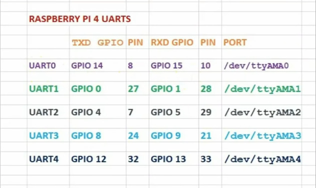

# Swarm System ARIITK

## Simulation Setup:
1. Add ssh key of your PC to github.I recommend you may use github cli which is installable through
`sudo apt-get install -y gh` and run `gh auth login` to automatically add ssh to your github account.
2. You can git clone using ssh or github cli using the following commands
SSH: `git clone --recursive git@github.com:AerialRobotics-IITK/Robofest25.git`
Github CLI: `gh repo clone --recursive AerialRobotics-IITK/Robofest25`
3. Now run following commands for use
### Single Drone
Single Drone `make uav1`
Gazebo Single Drone iris: `make gziris`

### Swarm
#### Ardupilot Only
Only Ardupilot `make swarm`

#### Gazebo Along with Ardupilot
First Run: `make gzswarm`
Next Run in a different terminal: `make ardugzswarm`

MAVROS(if required) `make mavswarm`

### Getting Working environment
4. Get a working environment by running
`make local`

## Deployment Setup
0. Open up Raspberry Pi's UART port and identify which device belongs to which port you can make use of the photo below

#### Note : The UART numbers are off by 1 and UART0 is available on /dev/ttyS0 on Raspberry 4

1. Place this folder either through zipping and sending it over ssh or git clone the repo (you may remove the --recursive or else it will only cause it to take a little more space)
2. Add the ip address of all the drones or zenoh systems you want to connect to in `./zenoh/router_config.json5`
3. Now run one of the following commands
USB: `make usb MAV_ID=2` or leave if MAV_ID required is 1 `make usb`
gpio(UART0) (raspi 5): `make gpio`
gpio4(UART0) (raspi 4): `make gpio4`
custom: `make custom DEVICE=/dev/{your_device} BAUD={value}`
4. Now if using mavros then run `ros2 launch swarm mavros.launch.py` inside tmux
5. Run your code as you did on simulation

## Note:
1. We are using Zenoh Router instead of default DDS,default DDS chokes the system and is not made for mesh network
2. Remove the ip address of the system on which zenoh router is running from `router_config.json5`
3. Give a unique `tgt_system` parameter in mavros launch command and `SYSID_THISMAV` parameter for each drone
4. Sleep for few seconds between takeoff and set_position/local
5. Never run Zenoh router twice on any device (even when in container and outside container both count as the same device)
6. You need to add how to install you dependencies inside `Dockerfile` in this folder for your code to compile
